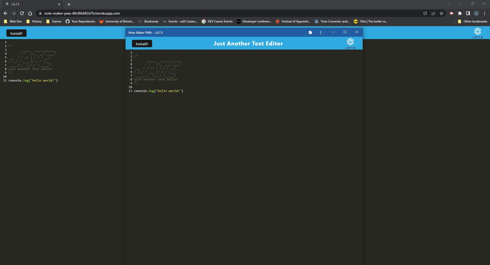

# myNoteMakerPWA   
 
## Description  
This application uses PWA principles to allow users to create and retrieve their notes either when online or offline. Users notes are stored inside the browser using IndexedDB. Users also have the option to install the application locally and have the same access and functionality they would using the web address. 

 
## Table of contents
[Description](#description)  
[Installation](#installation)  
[Usage](#usage)  
[License](#license)  
[Contribution](#contribution)  
[Tests](#tests)  
[Questions](#questions)  
## Installation  
To install the application, simply clone this repository to your application, run the command   
```md
npm i or npm install
```
then enter
```md
npm run build 
 ```
   followed by 
```md
npm run start 
``` 
then the website will load on  
```md
localhost:3000 
```
## Usage  
To use this application, simply click the heroku link at the bottom of the README to be redirected to the deployed page
## License  
N/A
## Contributing  
To contribute to this project, reach out to my email address linked at the bottom of this README with any suggestions and I will get back to you.
## Tests  
I ran all the available functions, whilst being connected and not connected, on the application to make sure they all work correctly.  
## Questions  
If you have any questions about this application, contact me via either my email address or my GitHub account.  
My email address: jakeorchard@live.co.uk  
My GitHub URL: https://github.com/Jake-Orch  
Deployed page: https://note-maker-pwa-48cf86482d7b.herokuapp.com/
